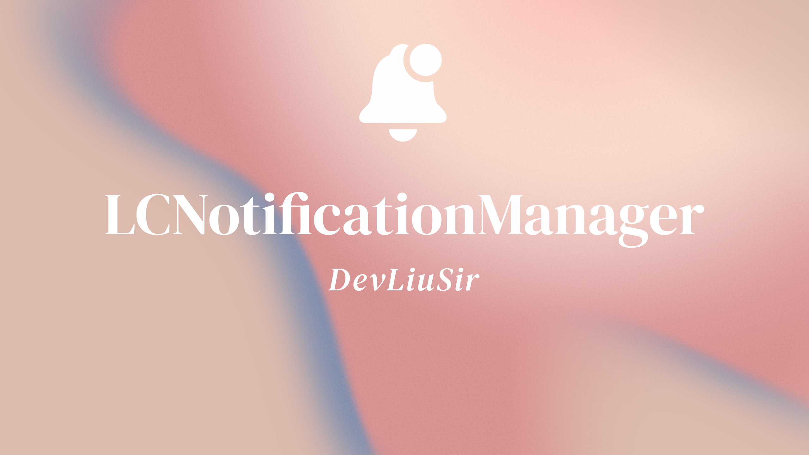

<p align="center">


<p align="center">    


<a href="https://twitter.com/LiuChuan_"></a>
</p>


> [中文](README_CN.md)


---
`LCNotificationManager` is a lightweight notification management framework that aims to simplify and unify notification management in iOS/macOS projects. It encapsulates common notification types, such as normal notifications (`NotificationCenter`), distributed notifications (`Distributed`), Darwin notifications (`CFNotification`), and workspace notifications (`NSWorkspace`), and provides a simple and consistent API for developers to use.

## Features

- **Normal notification management**: Simplifies the use of `NotificationCenter` and supports sending, adding, and removing observers.
- **Distributed notification**: Supports broadcasting notifications between different sessions and allows the delivery of additional information.
- **Darwin notification**: Low-level notifications for the macOS system, supporting the sending and receiving of specific system notifications.
- **Workspace notification**: Facilitates the sharing of status between applications and supports the sending and receiving of workspace-related notifications.


## Directory Structure

```
Sources/
├── LCNotificationManager/
│   └── Helpers/
│       ├── LCDistributedNotificationManager.swift   # Helper class for distributed notifications
│       ├── LCCFNotificationManager.swift           # Helper class for Darwin CF notifications
│       ├── LCWorkspaceNotificationManager.swift     # Helper class for workspace-related notifications
│       └── LCNotificationCenterManager.swift       # Helper class for NotificationCenter notifications

```


## Installation
### CocoaPods
LCNotificationManager is available through [CocoaPods](https://cocoapods.org). To install it, simply add the following line to your Podfile:

```swift

pod 'LCNotificationManager'

```


## License

MIT License

Copyright (c) 2022 Marvin


## Author

| [](https://github.com/DevLiuSir)  |  [DevLiuSir](https://github.com/DevLiuSir)<br/><br/><sub>Software Engineer</sub><br/> [][1] [][2] [][3]|
| :------------: | :------------: |

[1]: https://twitter.com/LiuChuan_
[2]: https://github.com/DevLiuSir
[3]: https://devliusir.com/

